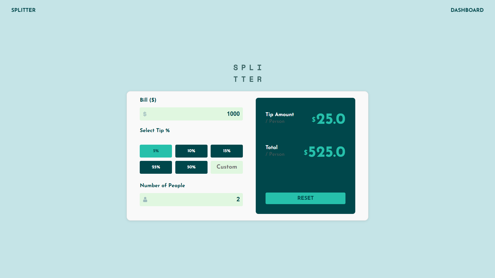
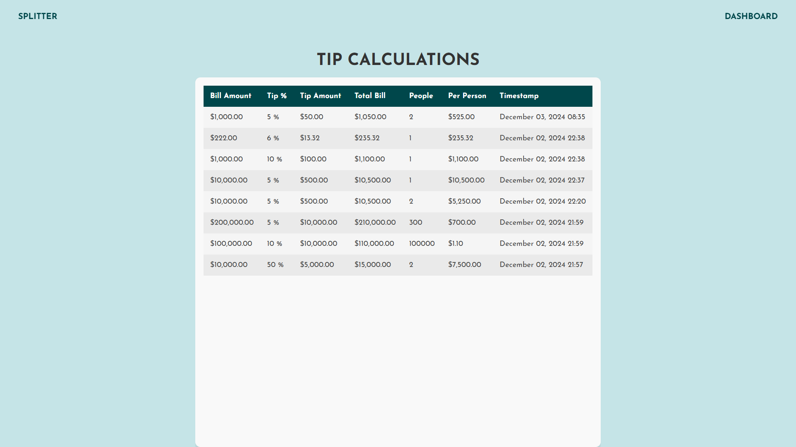

# Tip Calculator

A tip calculator built with Ruby on Rails. This application allows users to input a bill amount, select a tip percentage, specify the number of people splitting the bill, and instantly view the calculated results.

---

## Table of Contents

1. [Technical Overview](#technical-overview)
2. [Features](#features)
3. [Getting Started](#getting-started)
4. [System Dependencies](#system-dependencies)
5. [Setup Instructions](#setup-instructions)
6. [Database Setup](#database-setup)
7. [Running the Tests](#running-the-tests)
8. [Screenshots](#screenshots)
9. [Live Demo](#live-demo)
10. [Contributing](#contributing)
11. [License](#license)

---

## Technical Overview

### Problem Statement

Develop a comprehensive tip calculator application that allows users to split the bill among multiple users based on a custom or preset tip percentage. The application should include an admin dashboard for managing tips and provide seamless deployment to a cloud platform.

### Solution Highlights

- **Model**: A `Tip` model validates input fields (bill, tip_percentage, number_of_people) to ensure accurate calculations.
- **Controller**: The `TipsController` manages form submissions, processes the data, and returns JSON responses.
- **Views**: Clean, responsive UI built with ERB templates and CSS for styling.
- **JavaScript**: Handles asynchronous form submission, client side error validation, and dynamic UI updates.
- **Testing**: Comprehensive model and controller tests ensure robust functionality and reliable edge-case handling.
- **Admin Dashboard**: An admin only dashboard for viewing previous tips and their details.
- **Deployment**: Seamless deployment to a cloud platform ( Render) with environment-specific configurations for databases and other services. Live version can be assesed [here](https://tip-calculator-9dey.onrender.com/). Admin username **admin**: Admin password **admin123** 

---

## Features

- Input validation for bill amount, tip percentage, and number of people.
- Dynamic UI updates showing real-time calculations.
- Custom tip percentage input option.
- Responsive design for desktop and mobile users.
- Admin dashboard for viewing previous tips

---

## Getting Started

Follow these instructions to set up the project on your local machine.

---

## System Dependencies

- **Ruby**: >= 3.3.0
- **Rails**: >= 8.0.0
- **SQLite3**: For development and testing.
- **PostgreSQL**: (Optional) For production environments.
- **Node.js and Yarn**: For managing JavaScript dependencies.

---

## Setup instructions

### 1. Clone the Repository

```bash
git clone https://github.com/MikeMatovu/tip_calculator.git
cd tip_calculator
```

### 2. Install ruby gems

```bash
bundle install
```

### 3. Install javascript

```bash
yarn install
```

### 4. Set Up Environment Variables

Copy the `.env.example` file to `.env` and update the values with your own credentials:

```bash
cp .env.example .env
```
### 5. Create and Migrate the database

```bash
rails db:create
rails db:migrate
```

### 6. Start the rails server

```bash
ruby bin/rails server
```


## Running the tests

### 1. Prepare the database

```bash
rails db:test:prepare
```
### 2. Run the test suite
```bash
rails test
```

---

## Screenshots

  
*Main page showing the bill input, tip options, and results.*

  
*Tip calculation section displaying calculated tip and total amount per person.*

---

## Live Demo

Access the deployed application here: [Tip calculator](https://tip-calculator-9dey.onrender.com/). Admin username **admin**: Admin password **admin123** 

---

## Contributing

Contributions are welcome! Please follow these steps:

1. Fork the repository.
2. Create a feature branch: `git checkout -b feature-name`.
3. Commit your changes: `git commit -m "Add feature-name"`.
4. Push to the branch: `git push origin feature-name`.
5. Open a Pull Request.

---

## License

This project is licensed under the Free License. You are free to use, modify, and distribute the code as you wish


